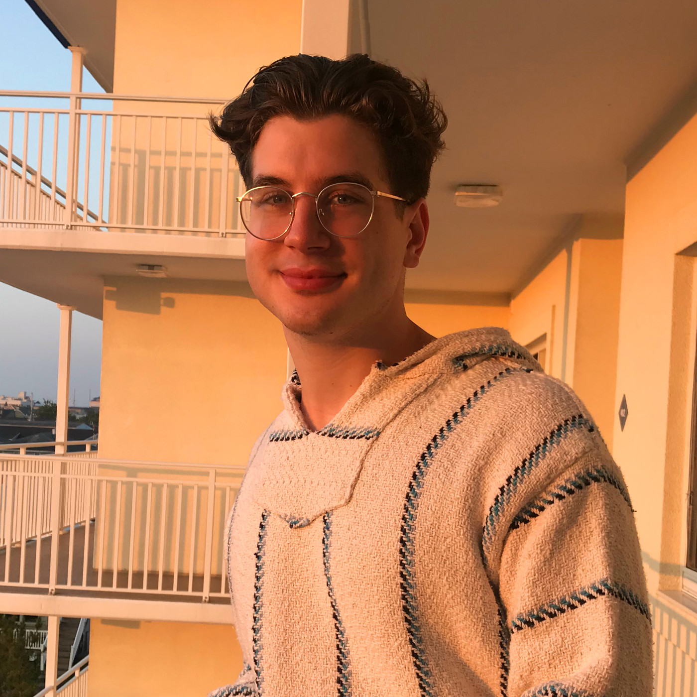

# Erik Boesen
- me@erikboesen.com
- erikboesen.com
- [Twitter](https://twitter.com/ErikBoesen) // [GitHub](https://github.com/ErikBoesen) // [Instagram](https://instagram.com/erikboesen) (account run by bot)

## Education
- 2015-2019 // George Mason High School, Falls Church, VA // Will graduate in 2019 with IB Diploma.
- 2017 // Virginia Residential Governor's School for Math, Science, and Technology

## Experience
### Technologies
- Proficient // Python, HTML/CSS/JS, C/C++, Go, Java, Ruby, GNU/Linux, Shell/UNIX
- Familiar // Perl, Lisp, Haskell

### Languages
- English (US) // Native Fluency
- Spanish // Working Proficiency - Took classes in school for 12 years, completing all levels offered. Participated in exchange program to Santiago de Chile as a Junior.
- Esperanto // Working Proficiency - Taught myself the world's most popular international auxillary constructed language.
- Mandarin Chinese // Basic Proficiency - Took classes during, before, and after traveling in the PRC.

### Organizations & Work
- FIRST Robotics Team 1418 // Occupied a variety of leadership positions on GMHS' FIRST Robotics Team 1418.
    - Positions:
        - Director of UI development 2016-2017:
            - Rewrote team's web-based robot control system, creating open-source [FRC Dashboard](https://github.com/FRCDashboard/FRCDashboard) framework with 60+ stars on GitHub
            - Rebuilt [team website](http://1418.team) from the ground up
            - Created a data-collection app for use during competitions
        - Programming captain 2017-2019:
            - Revamped education system for new members
            - Directed all programming operations
            - Created OpenCV machine-vision system for autonomous movement
        - Team Captain 2017-2019
    - Awards:
        - 2018 FIRST Robotics Competition Dean's List: I was one of 10 FRC students selected out of 91,000 to be placed on the FRC Dean's List in 2018. The Dean's List award is FIRST's most prestegious award for individual students and represents commitment to technical expertise and excellence as well as a passion for spreading the message of FIRST and STEM through one's community.
- [MIT Marine Autonomy Lab](http://oceanai.mit.edu/pavlab/pmwiki/pmwiki.php) intern
- CyberPatriot // Captain, Team 10-1018 (2018) and Team 11-1091 (2019).
- [MasonHacks](https://masonhacks.github.io) // Founded and directed George Mason High School's inaugural Hackathon.
- [The Academist](http://academist.press) // Started and administrated a high school news and opinion journal
- GMHS Hack Club // Founder and club leader
- Researching Convolutional Neural Networking for IB Extended Essay

### Awards & Accomplishments
- FIRST Dean's List winner in 2018: chosen as one of FIRST Robotics Competition's top students
- Winner of US Congressional App Challenge 2017 for [Opinr](http://opinr.me)
- Worked with VA General Assembly to pass HB1111, a bill organizing a STEAM Education Fund for technology education programs at underserved high schools
- Won George Mason High School Outstanding Computer Scientist award, being recognized as GMHS' top Computer Science student.
- Created robot driving dashboard which won FIRST Robotics Innovation in Control Award (2016, 2016, 2017)

### Hobbies & Interests
- Capoeira
- Music
- Politics
- Vexillology
